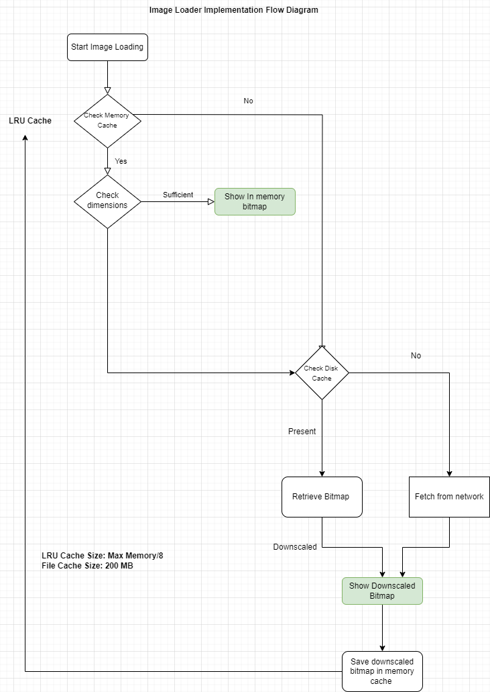

# Image Loading Assignment 

## Overview

The Image Grid App is an Android application that efficiently loads and displays images in a scrollable grid. This project demonstrates asynchronous image loading, caching mechanisms, and smooth scrolling without using any third-party image loading libraries.


## Features

### 1. Simple and Concise API
   - Load images into ImageViews with just a few lines of code.
   - Intuitive and easy-to-understand interface for seamless integration into your projects.

### 2. Automatic Caching
   - Images are automatically cached in memory and disk to improve performance and reduce network calls.
   - Efficient caching strategy ensures that frequently used images are readily available, enhancing user experience.

### 3. Downscaling
   - Optionally downscale images to reduce memory usage and improve loading times, especially for large images.
   - Specify custom downscale options to tailor the image loading process according to your application's requirements.

### 4. Cancellation
   - Supports cancellation of image loading tasks to optimize resource usage.
   - Easily cancel ongoing image loading tasks to prevent unnecessary work and improve responsiveness.

### 5. Memory Management
   - Efficient memory management to limit the memory footprint of cached images.
   - Automatically evicts least-recently-used images from memory cache to prevent out-of-memory errors.

### 6. View Lifecycle Handling
   - Listens to the view lifecycle events to cancel image loading tasks when the associated ImageView is detached from the window.
   - Prevents memory leaks and improves efficiency by canceling tasks for detached views.

### 7. Error Handling
   - Gracefully handles errors such as IOExceptions during image loading, ensuring robustness and reliability.
   - Provides clear error messages and fallback options to enhance user experience.

### 8. Cache Size Management
   - Manages cache size to prevent it from growing too large.
   - Automatically evicts least-recently-used images to free up memory and maintain optimal performance.


## Requirements

- Android Studio (latest version)
- Kotlin

## Showcase 

### Flow Diagram 


### Video 1 : First time loading with Internet and switching off internet (Showing cached response and cached images from disk) 
[Click here to watch](https://drive.google.com/file/d/1pXTg0DE6XAPtams1Y6JxFnnGvmBnqW5Y/view?usp=sharing)


### Video 2 : First time loading without Internet and switching on internet later (Showing network error handling and retry) 
[Click here to watch](https://drive.google.com/file/d/1kJWLYkS_Zdv4T9K30NW3N9Ga2WHoBHLL/view?usp=sharing)


## Implementation Details

```
ImageLoader.with(context)
    .load(imageUrl)
    .into(imageView)
    .placeholder(R.drawable.placeholder)
    .error(R.drawable.error)
    .downscale(200, 150)
    .load()
```


### Architecture

- **MainActivity**: Initializes the RecyclerView and sets up the adapter.
- **HomeAdapter**: Manages the list of images and binds view holders.
- **MediaViewHolder**: Handles the binding of individual items, including image loading and caching.
- **CachingUtil**: Utility class for handling memory and disk caching.
- **ImageLoader**: A utility class for handling image loading tasks. It provides a builder pattern for configuring image loading options, such as placeholders, error images, and downscaling options. It also manages the loading of images asynchronously, handling caching, and canceling ongoing loading tasks when necessary.


### Caching Strategy

- **Memory Cache**: Uses `LruCache` to cache images in memory for quick access.
- **Disk Cache**: Stores images on the device's internal storage for persistent caching.

## Getting Started

### Prerequisites

- Ensure you have the latest version of Android Studio installed.
- Clone this repository to your local machine.

### Installation

1. Open Android Studio.
2. Select "Open an existing Android Studio project".
3. Navigate to the cloned repository and select it.
4. Let Android Studio build the project.

### Running the Application

1. Connect an Android device or start an emulator.
2. Click the "Run" button in Android Studio.
3. The application should launch on the selected device/emulator.

